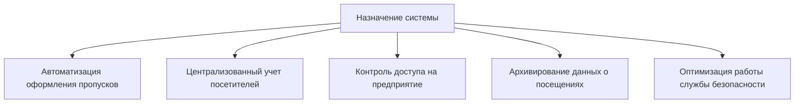
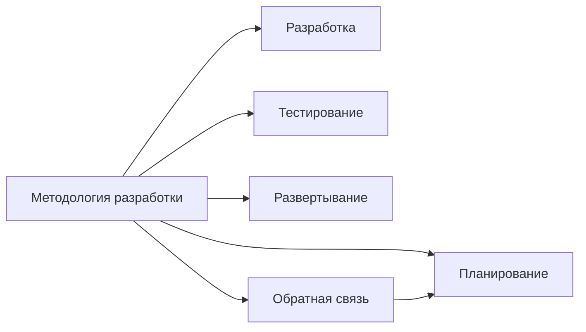
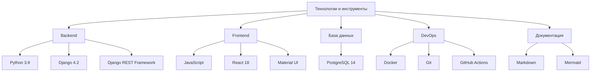

# Введение

## Аннотация

Данный документ представляет собой техническую документацию программного модуля для пропускной системы предприятия ЕИВЦ ОАО «РЖД». Система разработана с целью автоматизации процессов создания, управления и учета пропусков на предприятии.

Документация содержит полное описание архитектуры системы, деталей реализации, процедур тестирования, руководство пользователя, а также заключение и перспективы развития. Система реализована с использованием современных технологий, включая Django, React, PostgreSQL и Docker, что обеспечивает высокую производительность, масштабируемость и удобство использования.

Целевой аудиторией данной документации являются разработчики, системные администраторы, тестировщики и конечные пользователи системы.

## Общее описание проекта

### Цель и назначение системы

Система управления пропусками предназначена для автоматизации процесса оформления, учета и контроля пропусков на предприятии ЕИВЦ ОАО «РЖД». Основной целью разработки является повышение эффективности работы службы безопасности и упрощение процедуры получения пропусков для посетителей.

### Актуальность разработки

В современных условиях обеспечение безопасности предприятий является критически важной задачей. Традиционные бумажные системы учета пропусков имеют ряд существенных недостатков:

1. Высокая трудоемкость оформления пропусков
2. Сложность поиска и анализа информации
3. Риск потери или повреждения документов
4. Отсутствие централизованного хранилища данных
5. Сложность формирования отчетов и статистики

Разработанная система решает указанные проблемы путем цифровизации всех процессов, связанных с оформлением и учетом пропусков, что особенно актуально для крупных предприятий с большим потоком посетителей.

### Обзор существующих решений

Перед разработкой системы был проведен анализ существующих решений в области управления пропусками:

| Решение | Преимущества | Недостатки |
|---------|--------------|------------|
| Бумажные журналы учета | Простота использования, отсутствие зависимости от ИТ-инфраструктуры | Трудоемкость, сложность поиска информации, риск потери данных |
| Электронные таблицы | Улучшенный поиск и сортировка, простота внедрения | Ограниченные возможности автоматизации, проблемы с многопользовательским доступом |
| Готовые СКУД | Широкий функционал, интеграция с аппаратными средствами | Высокая стоимость, сложность адаптации под конкретные требования |
| Заказные решения | Полное соответствие требованиям заказчика | Длительные сроки разработки, высокая стоимость |

Анализ показал, что наиболее оптимальным вариантом является разработка собственного программного модуля, учитывающего специфику предприятия ЕИВЦ ОАО «РЖД» и интегрируемого с существующими системами.

### Структура документации

Документация системы управления пропусками имеет следующую структуру:

1. **Введение** - общее описание проекта, его цели и актуальность
2. **Описание проекта и требования** - функциональные и нефункциональные требования к системе
3. **Проектирование архитектуры системы** - общая архитектура, компоненты и их взаимодействие
4. **Схема и проектирование базы данных** - структура баз данных, таблицы, связи и оптимизация
5. **Детали реализации** - технический стек, реализация backend и frontend, конфигурация Docker
6. **Процедуры тестирования** - стратегия тестирования, виды тестов, автоматизация тестирования
7. **Руководство пользователя** - инструкции по работе с системой для конечных пользователей
8. **Заключение и перспективы развития** - результаты проекта, оценка эффективности, направления развития

## Методология разработки

При разработке системы управления пропусками использовался гибкий подход (Agile), который позволил адаптироваться к изменяющимся требованиям и обеспечить постепенное наращивание функциональности.

Процесс разработки был разделен на следующие этапы:

1. **Анализ требований** - сбор и анализ требований заказчика, определение функциональных и нефункциональных требований
2. **Проектирование архитектуры** - разработка общей архитектуры системы, выбор технологий, проектирование базы данных
3. **Разработка backend** - реализация серверной части, API, интеграция с базой данных
4. **Разработка frontend** - реализация пользовательского интерфейса, интеграция с backend
5. **Тестирование** - модульное, интеграционное, системное тестирование
6. **Развертывание** - настройка инфраструктуры, развертывание системы
7. **Документирование** - подготовка технической и пользовательской документации

## Используемые технологии и инструменты

Для реализации системы управления пропусками были выбраны следующие технологии и инструменты:

Выбор данных технологий обусловлен следующими факторами:

1. **Python и Django** - высокая скорость разработки, большое сообщество, широкие возможности для интеграции
2. **React** - компонентный подход, высокая производительность, удобство разработки интерфейсов
3. **PostgreSQL** - надежность, производительность, поддержка сложных запросов и транзакций
4. **Docker** - упрощение развертывания, стандартизация окружения, изоляция компонентов
5. **Markdown и Mermaid** - простота создания и поддержки документации, наглядность диаграмм

## Команда проекта

В разработке системы управления пропусками принимала участие команда специалистов с различными компетенциями:

- Руководитель проекта
- Бизнес-аналитик
- Архитектор программного обеспечения
- Backend-разработчики
- Frontend-разработчики
- Тестировщики
- Технический писатель
- DevOps-инженер

Каждый член команды внес свой вклад в успешную реализацию проекта, обеспечив высокое качество конечного продукта и соответствие требованиям заказчика. 